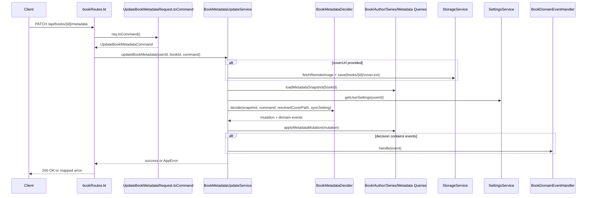

<!-- Derived from docs/Book-Metadata-Update-Flow.md — keep in sync -->

# Metadata Update Flow

This document explains the metadata update path and how Shelf maps API requests into validated domain commands.

## Goal

Move validation and parsing of complex update payloads out of service internals and into an explicit boundary mapping step:

- Route receives API DTO
- Route maps DTO to validated domain command
- Service orchestrates persistence and side effects using typed domain data

## High-Level Before vs After

### Before

```mermaid
flowchart LR
  A[HTTP PATCH /books/{id}/metadata] --> B[Route receives UpdateBookMetadataRequest DTO]
  B --> C[Service updateBookMetadata(request DTO)]
  C --> D[Service parses/validates raw strings inline]
  D --> E[DB transaction + storage + relinks + job enqueue]
```

### After

```mermaid
flowchart LR
  A[HTTP PATCH /books/{id}/metadata] --> B[Route receives UpdateBookMetadataRequest DTO]
  B --> C[toCommand() boundary mapper]
  C --> D[UpdateBookMetadataCommand + value objects]
  D --> E[Service updateBookMetadata(command)]
  E --> F[DB transaction + storage + relinks + job enqueue]
```

## Runtime Sequence



## Validation Boundary

```mermaid
flowchart TD
  A[UpdateBookMetadataRequest] --> B[toCommand()]
  B --> C[Domain value objects]
  C --> D[BookTitle / AuthorName / SeriesName / PublisherName]
  C --> E[PublishYear / Genre / Mood / CoverSourceUrl]
  C --> F[EditionIdentifiersCommand]
  D --> G[BookValidationError]
  E --> G
  F --> G
```

## Domain Types Involved

- `UpdateBookMetadataCommand`
- `AuthorRelinkIntent` (`UseExisting` / `UpsertByName`)
- `SeriesRelinkIntent.AuthorScopedUpsertByName`
- `EditionIdentifiersCommand`
- `BookMetadataDecider` + `BookMetadataMutation`
- `BookTitle`, `AuthorName`, `SeriesName`, `PublisherName`
- `PublishYear`, `Genre`, `Mood`, `CoverSourceUrl`

## Notes

- API contract for `PATCH /api/books/{id}/metadata` is unchanged.
- The route is now responsible for converting untrusted request data into validated domain command objects.
- Service logic remains behavior-compatible, but now consumes typed domain inputs.
- Series matching during metadata relink is author-scoped; identical series titles may exist across different author scopes.
