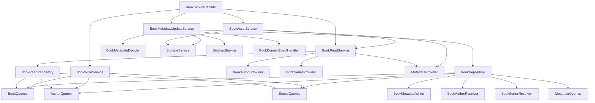
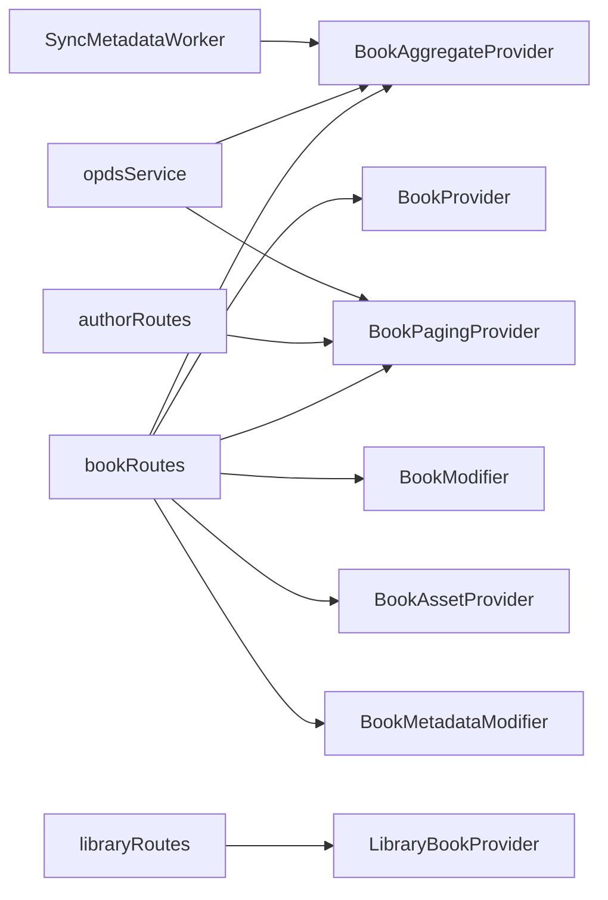

<!-- Derived from docs/Book-Service-Capability-Split.md — keep in sync -->

# Service Decomposition

This page documents the internal structure of the Book service after decomposition into capability-focused components.

## Intent

The previous `BookService` implementation had many unrelated responsibilities in one large class.
The new shape keeps the same public `BookService` umbrella interface but composes it from focused internal components:

- Read/query assembly
- Write/mutation operations
- Asset/edition resolution
- Metadata update orchestration

## Component View

## Capability Interfaces

The facade still exposes `BookService`, which combines:

- `BookProvider`
- `BookAggregateProvider`
- `BookPagingProvider`
- `AuthorBookProvider`
- `SeriesBookProvider`
- `LibraryBookProvider`
- `BookModifier`
- `BookAssetProvider`
- `BookMetadataModifier`

Consumers can depend on narrower interfaces instead of full `BookService`.

## Dependency Narrowing in Consumers

## Why This Matters

- **Reduces coupling:** each caller depends only on capabilities it actually uses.
- **Improves maintainability:** read/write/asset/metadata concerns evolve independently.
- **Preserves compatibility:** `BookService` remains available as the composed umbrella type.
- **Repository boundaries:** both query and mutation paths sit behind repository interfaces (`BookReadRepository` and `BookRepository`).

## Current Limits

- The metadata updater uses a domain decider for mutation and event decisions; further DDD work can push more invariants into richer aggregate behaviors.
- The metadata repository composes focused internal write ports (metadata writer + author/series resolvers), but these remain in one package boundary.
- The split is package-level (single module), not multi-module.
