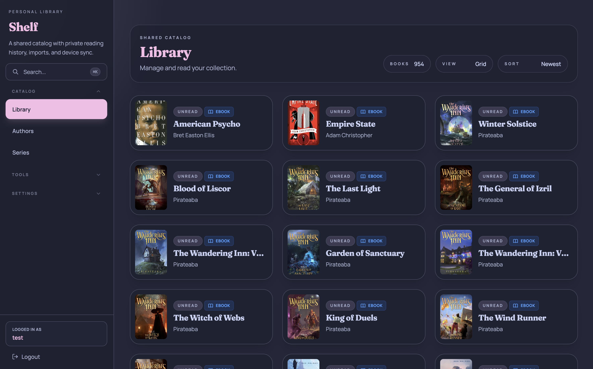
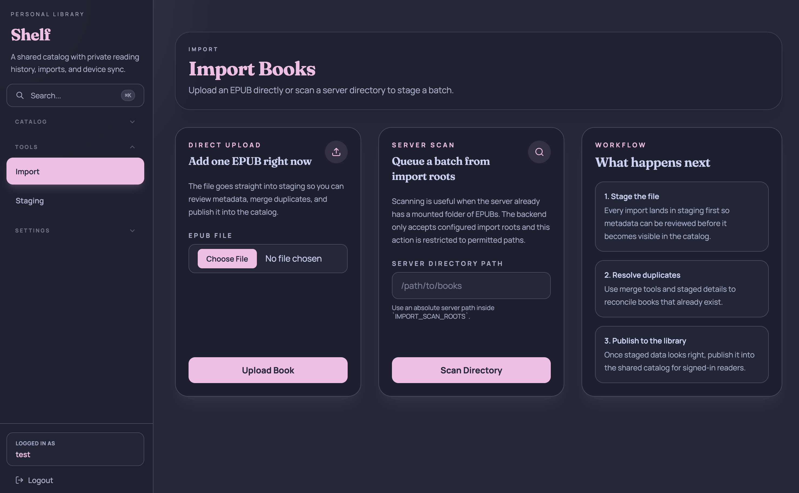
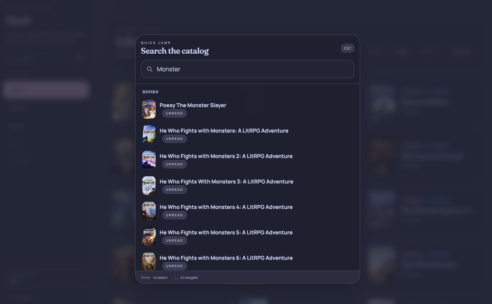
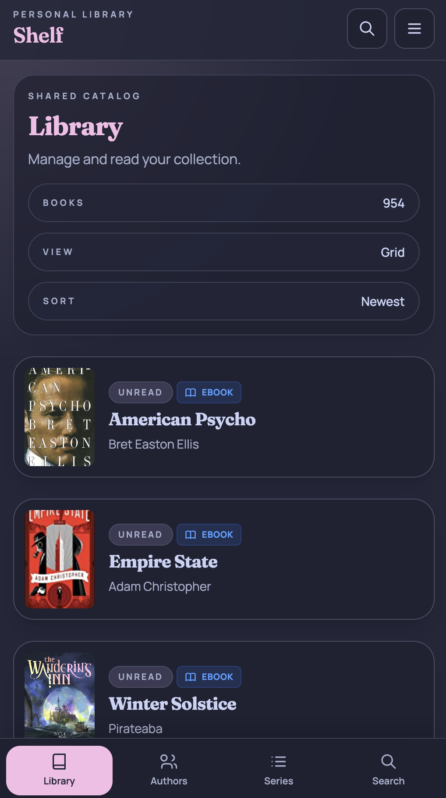
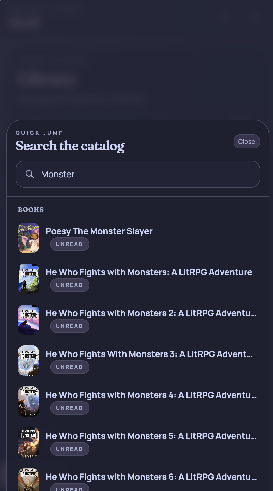

# Shelf

A modern, self-hosted book management system built with **Kotlin**, **Ktor**, **SQLDelight**, and **Arrow**. Shelf follows strict Functional Domain-Driven Design principles to provide a robust foundation for your personal digital library.

## Screenshots

### Desktop

### Mobile

## Features

- **EPUB and Audiobook Support** — Import and read EPUBs in-browser, or listen to audiobooks with a built-in web player.
- **Automatic Metadata Extraction** — Shelf reads metadata directly from your files during import scanning.
- **External Metadata Providers** — Fetch missing details from services like Hardcover.
- **OPDS Feed** — Connect your favorite e-reader apps (KOReader, Moon+ Reader, KyBook, and more).
- **KOReader Sync** — Full reading progress synchronization with KOReader devices.
- **Type-Safe Domain Model** — Persistence-aware identity types, validated domain commands, and functional error handling.
- **Responsive PWA** — Mobile-first web UI with offline support, installable on Android and iOS.
- **Observability** — OpenTelemetry traces, Prometheus metrics, and structured logging out of the box.
- **Self-Hosted** — Deploy with Docker Compose in minutes. Your data stays on your server.

## Quick Links

- [Quickstart](getting-started/quickstart.md) — Get Shelf running with Docker Compose.
- [User Guide](user-guide/importing-books.md) — Learn how to import books and manage your library.
- [Architecture](architecture/overview.md) — Understand how Shelf is built.
- [Contributing](contributing/development-setup.md) — Set up a development environment and start contributing.

## Tech Stack

| Component | Technology |
|-----------|------------|
| Backend | [Kotlin 2.x](https://kotlinlang.org/) + [Ktor](https://ktor.io/) |
| Functional Library | [Arrow 2.x](https://arrow-kt.io/) |
| Database | [PostgreSQL](https://www.postgresql.org/) |
| Persistence | [SQLDelight](https://sqldelight.github.io/sqldelight/) |
| Frontend | [Svelte 5](https://svelte.dev/) + [SvelteKit](https://svelte.dev/docs/kit) |
| Caching | [Valkey](https://valkey.io/) (Redis-compatible) |
| Build | [Gradle](https://gradle.org/) (Kotlin DSL) |
| Deployment | [Docker Compose](https://docs.docker.com/compose/) |

## License

Shelf is licensed under the [MIT License](https://github.com/tarantini-io/shelf/blob/main/LICENSE).
